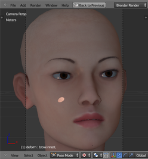
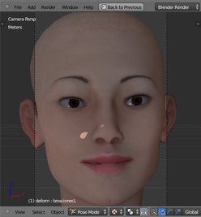
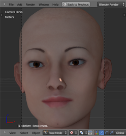

ROS Indigo + Blender + OpenCog
==============================
Docker files for Hanson Robotics robots and heads.  The most
sophisticated of the bunch is Eva, an animated female head, capable
of seeing you (via a webcam), talking to you (via a chatbot), and
engaging you (and your guests) in social interaction.  She will
make eye contact, and express her pleasure with smiles and looks
of surprise and happiness.

  

## Hierarchy and dependents

The docker image hierarchy is slightly more complex than it could be.
It has been driven into this state in order to accomodate the conflicting
needs of ROS+Docker.  The root cause is discussed further down below.
In short, ROS and Docker have conflicting ideas about how networking
should work; this forces us to install everything into one giant Docker
container.  This is not ideal, but it works.  See the design discussion
below.

    ├─ros-indigo-base
      ├─ros-indigo-opencog
        ├─ros-incog-blender
          ├─eva-opencog
      ├─ros-indigo-blender
        ├─eva-owyl
        ├─eva-ros
        ├─ros-arthur-animation
        ├─ros-arthur-dev
      ├─ros-indigo-dev
        ├─ros-indigo-einstein
        ├─ros-indigo-zenorsm


* `ros-base` contains a docker image defining only the basic ROS indigo
   nodes shared by all robots, and nothing more.

* `ros-opencog` contains a docker image for ROS and OpenCog. Depends
   on `ros-base`, above.  It does not provide anything beyond a
   configured ROS+OpenCog environment.

* `ros-blender` contains a docker image for ROS and blender. Depends
   on `ros-base`, above.  It does not provide anything beyond a
   configured ROS+blender environment.

* `ros-incog-blender` contains a docker image for ROS, opencog and
   blender. Depends on `ros-opencog`, above.  It does not provide
   anything beyond a configured ROS+opencog+blender environment.

* `eva-ros` contains the basic Hanson Robotics Eva blender rig,
   together with the ROS nodes needed for vision processing.
   Upon startup, it will automatically run the blender rig and the
   vision subsystem.  However, it is missing the chatbot and the
   behavior subsystem; Eva will stare blankly into space and breath,
   but do nothing more.

* `eva-owyl` is a a stand-alone demo of the basic Hanson Robotics
   Eva blender rig, showing the full range of emotional facial
   expressions, ranging from happiness to frustration, excitement
   to boredom, as well as gestures such as shakes, nods, blinks and
   a keep-alive breathing cycle. It includes basic vision processing
   and basic human-face awareness behavior, but without a chatbot or
   any OpenCog processing software.  This is a stand-alone demo,
   without any other dependencies. It is representative of the state
   of development of the Hanson Robotics Eva blender rig, as of
   May 2015.

* `eva-silent` contains the Eva blender rig, ROS, and OpenCog, but not
   the chatbot.  Behaviors are executed using an OpenCog-based behavior
   tree, very similar to the owyl tree.  She can see you, and reacts
	to your presence by making eye contact, smiling, and showing general
   interest.  She reacts to absence by being bored and falling asleep.

* `eva-opencog` contains the Eva blender rig, ROS, OpenCog, chatbot.
   This is the whole kit-n-kaboodle. Under development.  Sometimes
   works, sometimes broken.

## Miscellaneous packages

* `dev`, derived from `base`, contains a docker image for a ROS indigo
   development environment.

* `einstein` container for the Hanson Robotics' small Einstein head.
  This container was demoed at ROS Kong 2014 by David Hanson.

* `zenorsm` ... Zeno ?? with Einstein head ??

## Unmaintained images
The `arthur-animation` and `arthur-dev` packages are deprecated. They
implement an older animation system that was difficult to work with.
Most importantly, eye-tracking and emotion gestures were not blended
and integrated in an easy-to-use fashion.

* `arthur-animation` contains a demo for the Hanson Robotics Arthur head,
   showing how ROS messages can be used to control facial animations.
   That is, the blender rig is encapsulated in a ROS node; the rig
   reacts to ROS messages.

* `arthur-dev` contains the full end-to-end development environment
   for the Hanson Robotics Arthur head.  This includes a half-dozen
   ROS nodes for camera and vision processing, scripted behavior trees,
   motor controllers, and a web-based user interface.

## Building
Most subdirectories contain a `build.sh` script for building the
particular docker image.

Use `build-all.sh` to build the Eva docker image and it's dependents.
This may take an hour or more.

## Running
Most subdirectories contain a pair of scripts: `run.sh` and `stop.sh`.
These will run and stop the containers defined in that directory.

# ROS+Docker Container Design
Building a well-designed system using Docker and ROS is impossible at
this point in time (as of spring 2016). This is because the way that
Docker does networking is in direct conflict with how ROS does
networking.  The primary issue is that ROS messages contain port
numbers in them, whereas Docker networking uses proxies to remap ports
between containers. This means that the port numbers in the ROS messages
do not match the actual port numbers being used in the Docker container.
This can be hacked around in various ways, but none of the hacks solve
all of the problems.

The way that Docker does networking is changing (for Swarm), while ROS
will also change, with a completely different messaging system for ROS2.
It will be a while before the dust settles and there's a coherent
networking policy.

In the meantime, there are three reasonable design choices:

* Put OpenCog and ROS in the same Docker container.   This is ugly
  and unpleasant, and not a reasonable design choice at all, but it's
  the one we take, because nothing else works.

* Put Eva blender and vision in one Docker container, (or maybe two
  containers, one for blender, and one for vision) and OpenCog in a
  third container. This is an ideal design, but cannot be made to work
  due to conflicting networking models.

* Put every ROS node into its own container. This would result in a
  half-dozen to a dozen or more containers, and becomes a manageability
  issue: too many containers to correctly build, set up, monitor, and
  run.  Might work for some super-admin with superman-cloud-fu, but is
  way too complicated for us AI scientists.  Also, at this time, it also
  won't work, due to design limitations/flaws with Docker+ROS networking.

Below is a discussion and notes about the issues that block the second
and third design points.

Main issue: a ROS publisher inside a Docker container cannot be
subscribed to outside of a Docker container.  There are several ways
to set this up and try to hack around it.

## Version A: Default Docker networking.
Start the ROS container in directory `base` using the `./run.sh` command.
Make yourself a tmux session as follows (this is for convenience only):
```
byobu new-session -d -n 'aa' '$SHELL'
tmux new-window -n 'bb' '$SHELL'
tmux new-window -n 'cc' '$SHELL'
tmux new-window -n 'dd' '$SHELL'
echo "tmux_left=\"session\"" > $HOME/.byobu/status
echo "tmux_right=\"load_average disk_io date time\"" >> $HOME/.byobu/status
tmux attach
```
Start `roscore` by hand in one terminal.  In another terminal, publish
something:
```
rostopic pub -r 5 /foo std_msgs/String '{data: hallooooo}'
```
In a third terminal, subscribe:
```
rostopic echo /foo
```
Yayy! This works!  Can we subscribe to this topic outside of this
container? No, we cannot. Here's how to check.  Inside a terminal, say
`ifconfig` and get the IP address of the container. Its will probably be
`172.17.0.2`.  Alternately, you can get this number from the outside,
with
```
docker inspect opencog-eva-ros | grep IPAdress
```
We can now attempt to contact ROS from the outside world. First, set
```
export ROS_MASTER_URI=http://172.17.0.2:11311
```
Now, ROS will *almost* work. But not quite.  This works:
```
rostopic list
rostopic info /foo
```
This fails (it hangs):
```
rostopic echo /foo
```
The reason that this is broken is because ROS messages themselves contain
tcpip port numbers, and Docker uses a form of port proxying and
firewalling (iptables) that remaps ports. Thus, port numbers inside the
container do not match the port number contained in the message, when
that message is coming from outside the container.  This mis-match is at
the root of the hang.

Curiously, the reversed process works: if you publish on the outside,
then you can subscribe on the inside, just fine.

This issue prevents the natural separation between OpenCog and Eva-ROS.
The Eva-ROS container is publishing `/camera/face_locations` and OpenCog
subscribes to that to find out about the location of human faces visible
to Eva.  Since the messages never arrive, Eva is blind, and sees
nothing.

## Version B: New Docker networking.
Starting with Docker version 1.9 (the current version in Ubuntu 14.04
trusty LTS), docker introduces a networking overlay.  This seems like it
is almost enough to get ROS working in Docker, and there are even some
'famous' highly visible tutorials for this:

* [Official ROS Docker Tutorial](http://wiki.ros.org/docker/Tutorials/Docker)
* [Todd Sampson Blog](http://toddsampson.com/post/131227320927/docker-experimental-networking-and-ros)

However, these tutorials are misleading: Some stuff works, but other,
different stuff breaks, and the original problem remains unsolved. This
can be reproduced as described below. Their success depends on using
Docker networks, and being very very careful -- diligently careful --
about setting ROS environment variables. This makes the whole process
very fragile, and subject to lots of confusion. YMMV.

First, create a Docker network:
```
docker network create boingo
```
Start three ROS containers. One, called the `master`, will contain
`roscore`.  The other two will publish and subscribe to each-other.
There are several ways to start these, including the setting of ROS
environment variables during startup.  This won't be done for this
example, since it clouds the issue: it confuses what is really
happening.  The environment variables can be set by hand, after
startup.  Start the containers as follows:
```
docker run --net=boingo --name=master -p 11311:11311 -it opencog/ros-indigo-base
docker run --net=boingo --name=aaa -p 11311:11311 -it opencog/ros-indigo-base
docker run --net=boingo --name=bbb -p 11311:11311 -it opencog/ros-indigo-base
```
Note the `--net=boingo` parameter. This causes Docker to use a different
set of network addresses. It also alters how Docker does port proxying.
Although the proxying is different, the core issue of re-labelling port
numbers remains: the ROS messages still have port numbers in them that
fail to match up with the actual port assignments.  Let's plow onwards.

Start `roscore` inside container `master`. Next, inside `aaa`, do this:
```
export ROS_HOSTNAME=aaa
export ROS_MASTER_URI=http://master:11311
rostopic pub -r 5 /bar std_msgs/String '{data: olaaa}'
```
while inside `bbb`, do this:
```
export ROS_HOSTNAME=bbb
export ROS_MASTER_URI=http://master:11311
rostopic echo /bar
```
Yayyy! This works! They can hear each other!  This is the sum-total of
the widely-publicized, easy-to-find ROS+Docker tutorials all over the
net.  That all is not right heaven is easy to see.  Outside of the
containers, `rostopic list` and `rostopic info /bar` works just as
before, and `rostopic echo /bar` still fails, as before.  Unlike before,
however, there is now a new failure: go to container `aaa`, and, in a
new tmux terminal, try `rostopic echo /bar` -- it doesn't work!!! This
is a new failure: subscribers can no longer hear publishers living
inside the same container!  Be careful to export the `ROS_HOSTNAME`
correctly in the new tmux terminal; failing to do this adds to the
confusion. You may experiment at this point: you won't get lucky,
though, even though it seems like you might, with just one more try.

This new failure mode forces one to a new design point that might seem
reasonable, but is ultimately untenable: one ROS node per container.
This might almost work, although its terribly fragile. Debugging is
hard, because if you're outside a container, you cannot hear what they
are passing around to each-other.  Altering the network structure
becomes difficult.  Using tools like `rviz` to visualize the ROS network
becomes difficult, because you now have to put `rviz` in it's own Docker
container, and then punch a hole through it to get the graphs to
display on your screen. It devolves from there, and by the time you get
to OpenCog, you've got the cogserver launching one python thread for ROS
messaging, while other threads send scheme over other sockets, while yet
more threads are handling tcpip sockets to IRC, and messages are flying
every-which way.  It appears that the Docker philosophy of "one process
per container" is untenable, in any practical sense.  Its too hard to
manage, too hard to configure and control.  Perhaps Docker Swarm might
one day help with this, but perhaps not: Swarm seems to push the problem
around; it doesn't solve the core issue: ROS messages contain port
numbers, and Docker proxying re-assigns ports.  That is the core issue.

## Version B.1: Newer version of Docker??
[It has been reported](https://gist.github.com/ruffsl/4a24c26a1aa2cc733c64)
that perhaps version 1.10 of docker does not have these problems.  I
have not yet tried.

## Version C: Desperation.
There are several stunts that one might think could work, but they
don't.  A brief report here.

### Remap all the ports
That is, start the Docker container with something like this:
`-p 32768-65536:32768-65536`. *DO NOT EVEN TRY THIS* -- you'll be
sorry if you do.  If you do, it will take Docker five minutes to remap
about 2K of these ports, at which point you will wonder what's going
on. What its doing is creating a process `docker-proxy -proto tcp
-host-ip 0.0.0.0 -host-port 60374 -container-ip 172.18.0.2
-container-port 60374` -- one for each port.  So `ps ax |grep docker |wc`
will tell you how many its done so far. Problem: you can't stop the
container. You can `kill -9` it, but the proxying keeps going on. We're
in a bad state now, so you can try `service docker stop` which won't
work, so you can `kill -9` it.  Which works. However `service docker
start` leaves vast quantities of crap in `iptables`, which you can
clean with `iptables -t nat -F`.  However, `service docker start` merely
recreates these bogus filters. So you have to `iptables` while Docker is
running.  Which hoses Docker, so you have to stop and restart again.
Anyway, the unclean docker shutdown also left crap in `aufs` -- some
dead docker containers that cannot be `docker rm`'ed. If you are brave,
you can now go into `/var/lib/docker/aufs` and clean up by hand.  Or
you can reboot ...  Ugh.

### Speaking of iptables...
Several stack-exchange questions deal with using `iptables` to remap
ports between docker containers and the host.  If you're naive, you might
hope that that will solve the problem. It won't. The core issue is that
ROS messages contain port numbers in them, and Docker remaps ports.  The
only way that masquerading could be don't would be just like
masquerading for FTP: you have to inspect the packets themselves, find
the port number in them, and then re-write the port number.  Since some
ROS messages are strings, this can be challenging. Checksums and gzip
add to the mess.

### Use the host network
Start all of the containers with `--net=host`.  This will cause Docker
to not use its own private networks, but instead, use the IP address of
the host for all networking.  From the Docker point of view, its really
not ideal, its a kind-of-a-hack.  From the ROS point of view, you might
expect that everything will now start working, since, after all, there
are no more networking barriers anywhere. Right? Almost!

With this network setting, you can now publish, with `rostopic pub`
inside the container, and subscribe, with `rostopic echo` on the
outside, and this now works.  The toy example works! At last! Woot!

Unfortunately, that's all that works. The real-life ROS nodes inside the
ros-eva container are publishing messages that still cannot be heard
outside of the container: specifically, `rostopic echo /camera/face_locations`
fails.  You might think that it should work. It doesn't.  I don't
understand why it doesn't, when the toy examples do work. Clearly,
there's yet more to ROS networking, and the Docker `--net=host` is not
enough to make things transparent.

## Version D: Hard reality
The misery documented above points us in only one direction.  Its not a
pretty one... its not `docker compose` and its conceptually icky and
not a good software design.  However, its the only solution that works:
Stick all of OpenCog (specifically, the CogServer) into the same Docker
container with ROS.  That will be one giant bloated container.  But
that's what the school of hard knocks teaches you.
